# CRT Plus

> **Cool Retro Term — Supercharged**

A retro supercharged terminal for macOS with enhanced profile management, split panes, and authentic CRT simulation. Based on [cool-retro-term](https://github.com/Swordfish90/cool-retro-term).

| Split Panes | Tabs & Profiles | Amber CRT |
|:-----------:|:---------------:|:---------:|
| 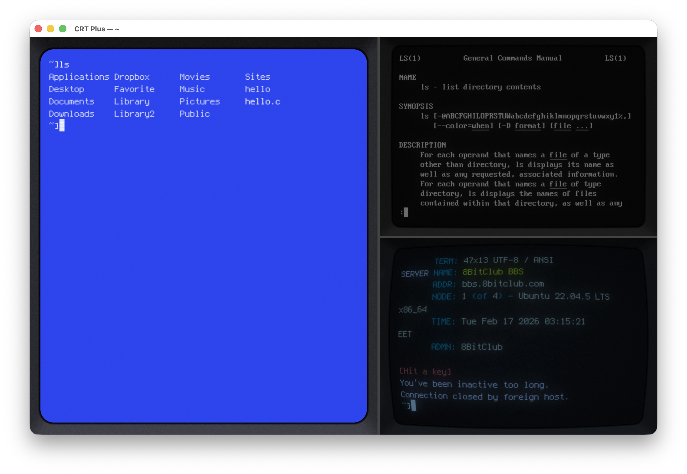 | 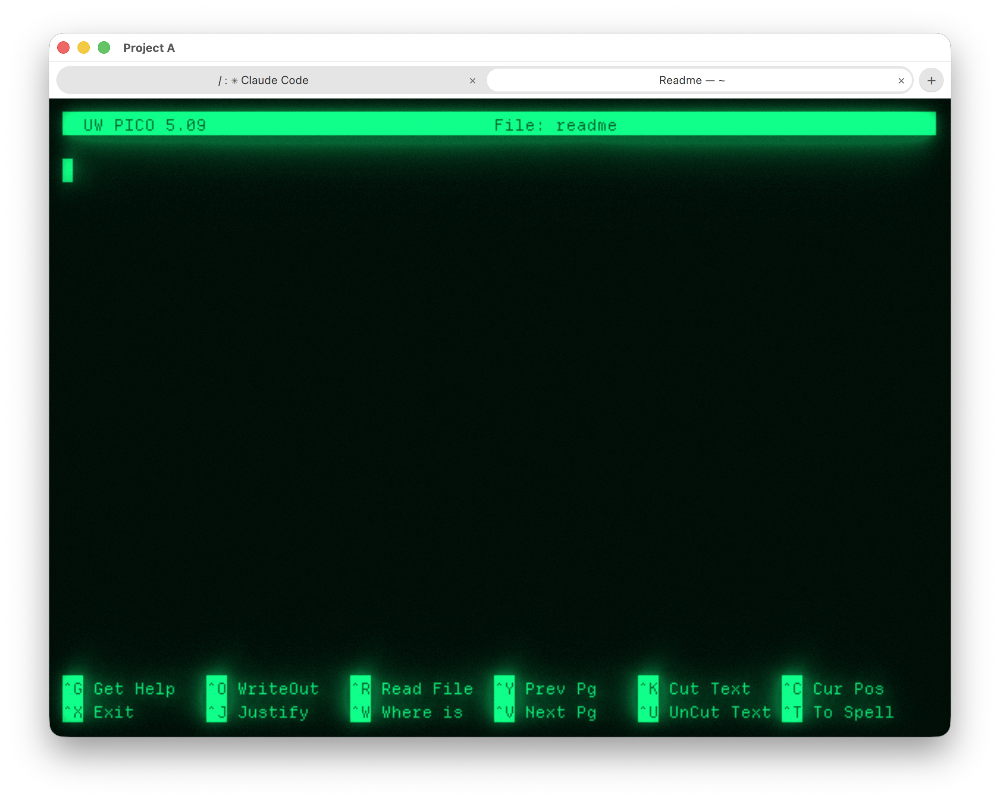 | 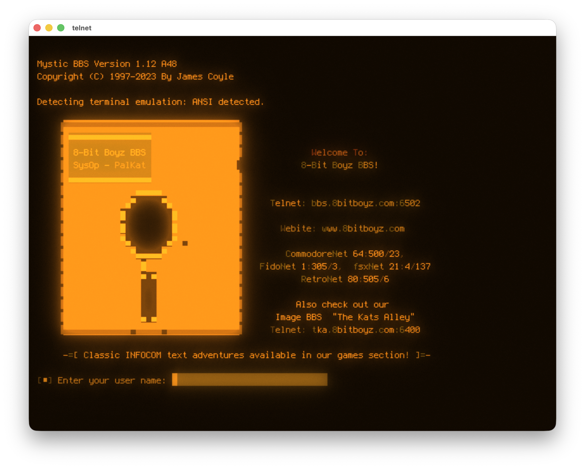 |
| **Appearance** | **Effects** | **Profiles** |
| 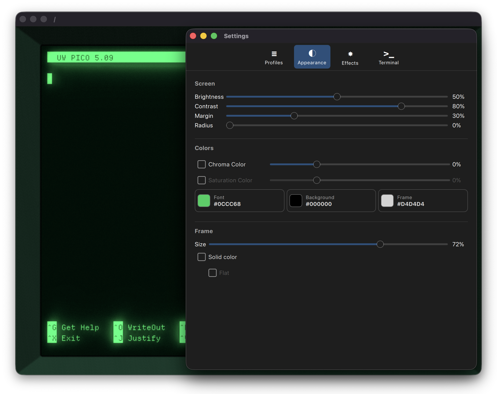 | 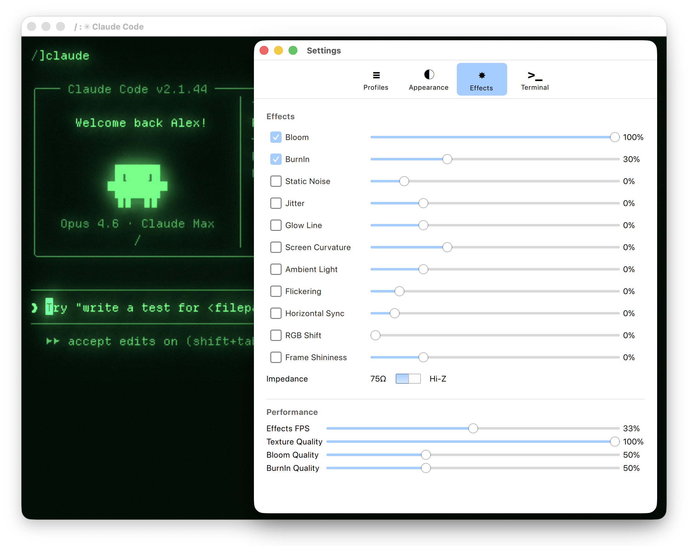 | 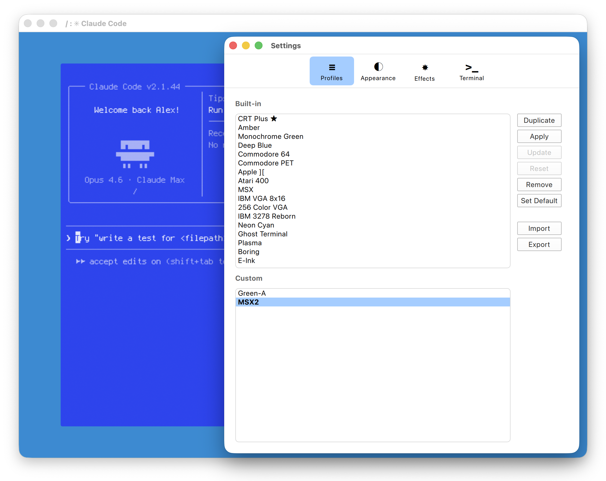 |

## About

**Website**: [crtplus.fromhelloworld.com](https://crtplus.fromhelloworld.com)

Working in the terminal is back — thanks to AI! If you're like me, you end up with dozens of terminal windows and tabs, and quickly finding the right one to go back to becomes a real challenge.

I was looking for a terminal that could solve this when I stumbled upon Cool Retro Term — a terminal emulator with gorgeous retro visuals. I loved the aesthetic, but I needed more from it. So I forked it and supercharged it into **CRT Plus**: different profiles per window, pane, and tab so you can visually distinguish your workspaces at a glance.

Along the way, I redesigned the settings, added a few extra tweaks, and built new features like **session persistence** (incredibly handy — your shells survive app restarts), **window and tab renaming**, **split panes**, **clickable file paths**, **Finder Services**, **drag & drop** for files and folders, and more.

I hope you enjoy it as much as I do. Happy coding, everyone!

CRT Plus is a terminal emulator that mimics the look and feel of old cathode tube screens. It's designed to be eye-candy, customizable, and reasonably lightweight. It uses a QML port of qtermwidget (Konsole) and requires macOS with Qt6.

Settings such as colors, fonts, and effects can be accessed via the menu bar or context menu.

| | | |
|:-:|:-:|:-:|
| 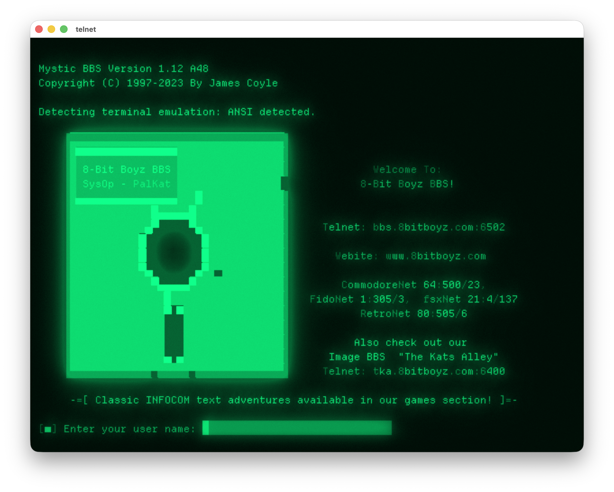 | 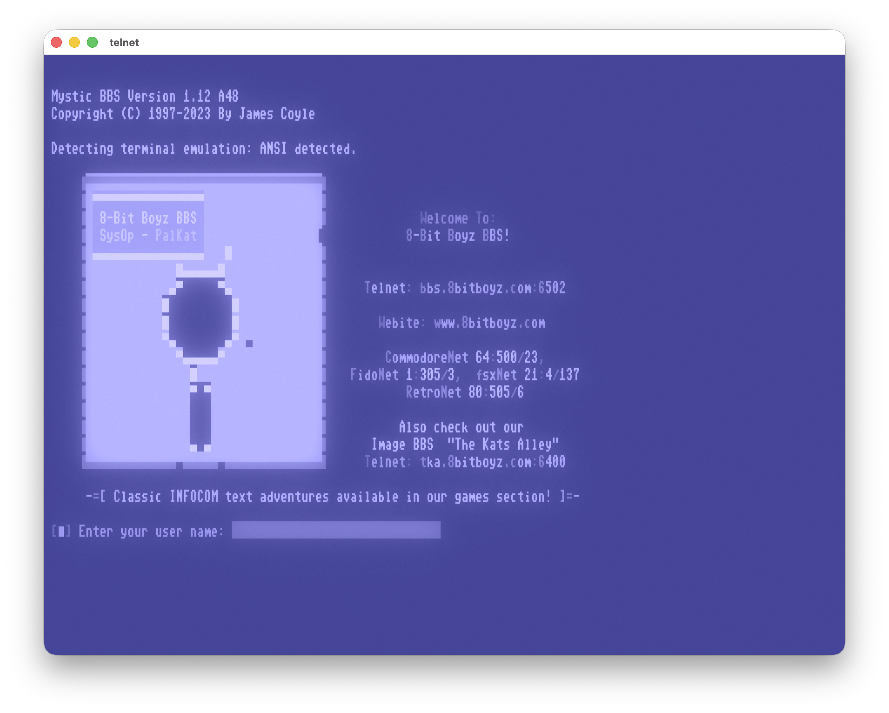 | 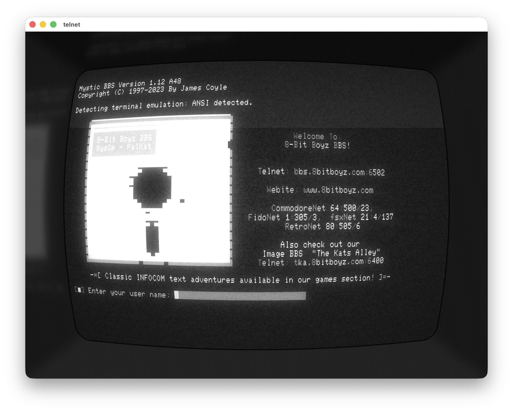 |
| 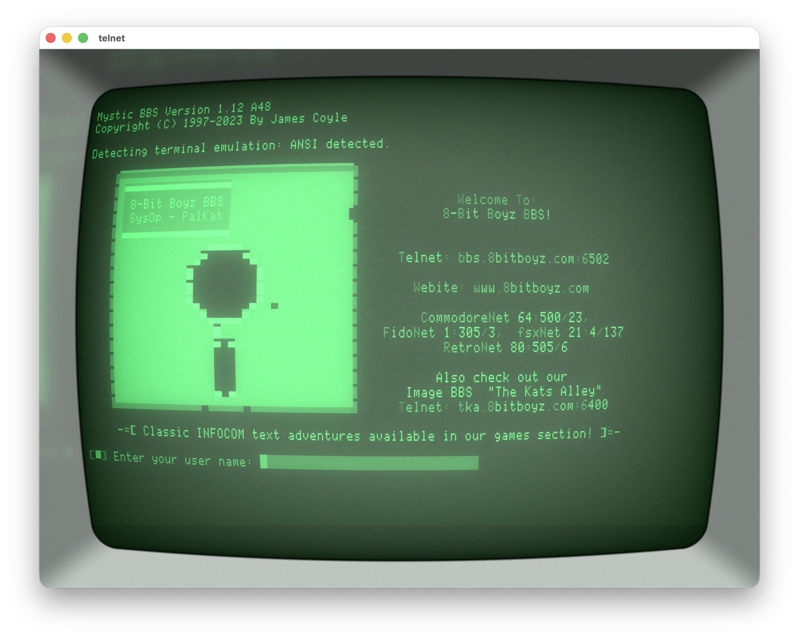 | 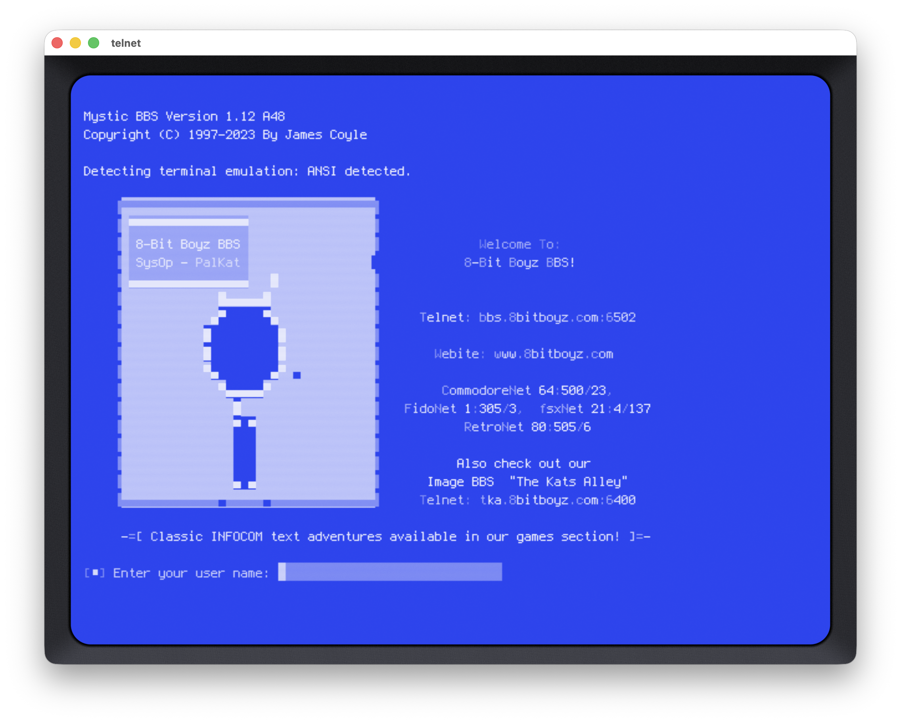 | 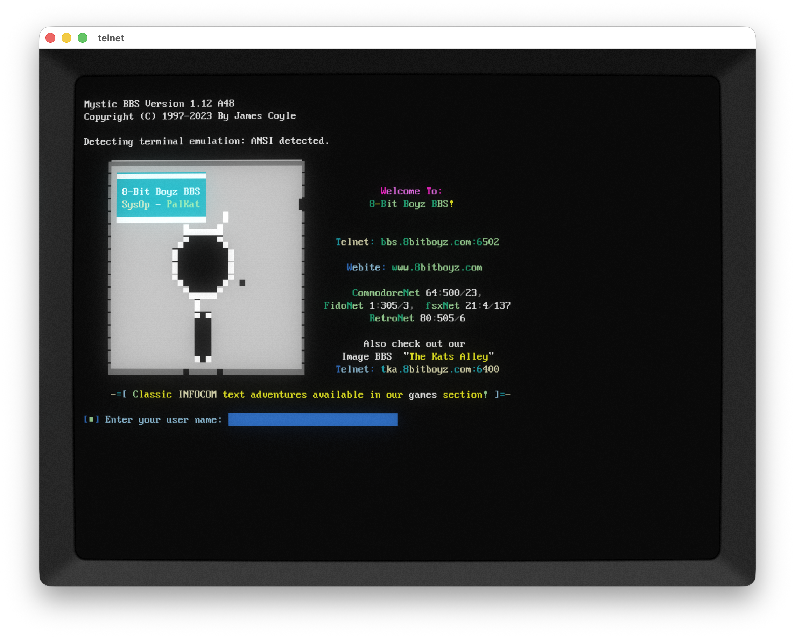 |

## New Features

### Per-Tab/Window Profiles
Each tab and window maintains its own independent profile. Change the look of one terminal without affecting others.

### Default Profile System
- **Set Default** button to choose which profile loads on startup and for new windows/tabs
- Star indicator shows which profile is set as default
- **Update** button to save current settings to the selected profile
- **Reset** button to restore built-in profiles to their original values

### Profile Menu Sections
The Profiles menu separates built-in and custom profiles with a visible divider for quick access.

### 75/Hi-Z Impedance Switch
Simulates the input termination switch found on real CRT monitors:
- **75 (terminated)** — Normal signal levels
- **Hi-Z (unterminated)** — Boosted brightness and glow, just like a real overdriven CRT

### Dynamic Window & Tab Titles
Titles update automatically as you work, showing the current directory with `~` substitution — just like macOS Terminal.
- Default display: `~/Projects` or `~/Projects: vim`
- When a CLI app sets its own title, it shows until the app exits, then reverts to the directory
- **Rename**: Right-click a tab or use **Shell > Rename Tab** (Cmd+R)
- **Reset**: Right-click a tab and select "Reset Name", or use **Shell > Reset Tab Name**
- Custom names show as `Custom Name (~/dir)` or `Custom Name (~/dir): process`

### Split Panes
Split any terminal into multiple panes for side-by-side workflows:
- **Split Right**: Cmd+D
- **Split Down**: Cmd+Shift+D
- **Navigate**: Cmd+] / Cmd+[ to cycle focus between panes
- **Close Pane**: Cmd+Shift+W
- Each pane maintains its own independent profile, directory, and process tracking
- Panes can be split recursively — split any pane further in either direction

### Clickable File Paths & URLs
Cmd+click to open file paths, URLs, and directories directly from terminal output:
- **File paths**: Opens in your editor — auto-detects Cursor, VS Code, Sublime Text, or uses `$VISUAL`/`$EDITOR`
- **URLs**: Opens in default browser
- **Directories**: Opens in Finder
- **Line numbers**: Supports `file.ext:line:col` — jumps straight to the right line
- **Hover preview**: Hold Cmd and hover to see underline highlighting before clicking
- **Smart detection**: Handles filenames with spaces, wrapped lines, and quoted paths
- **Right-click menu**: "Open" item appears when right-clicking on a clickable target
- **Remote sessions**: Over SSH/mosh, sends editor commands to the remote terminal instead
- **Configurable**: Set preferred editor in Settings > Editors

### Dock Badge Notifications
Get notified when background tabs, panes, or windows need attention:
- **Terminal bell** (`\a`) increments the dock icon badge count
- **Background activity** sets a badge when new output appears in unfocused panes
- Tab bar shows a dot on tabs with pending notifications
- Window title shows a dot when any tab/pane has a badge
- Badges clear automatically when you focus the relevant pane or tab

### Session Persistence
Your terminal sessions survive app restarts. When you quit CRT Plus, running shells and their scrollback are preserved by a lightweight background daemon. On relaunch, a dialog offers to restore your previous session — windows, tabs, splits, and all.
- **Automatic**: Sessions are saved on quit and restored on next launch
- **"Always restore without asking"** option to skip the dialog
- **Daemon-backed**: A small `crt-sessiond` process keeps PTYs alive between app launches
- **Graceful timeout**: If you don't relaunch within the timeout period, sessions are cleaned up automatically

### Drag-to-Reorder Tabs
Rearrange tabs by dragging them, just like macOS Terminal:
- **Drag** any tab to move it — neighboring tabs slide apart to show the drop position
- A floating ghost tab follows your cursor during the drag
- Terminal sessions, profiles, and running processes survive reordering
- macOS Terminal-style tab bar with pill-shaped tabs, hover highlights, and separators
- Automatic light/dark mode support

### Drag & Drop Support
- **Into terminal window**: Drag a file or folder and its path is inserted at the cursor — ready for `cd`, `cat`, or any command
- **Onto dock icon**: Drag a folder onto the dock icon to open a new terminal window in that directory

### Finder Services
Right-click any folder in Finder > Services to open it in CRT Plus:
- **New CRT Plus at Folder** — Opens a new window at that directory
- **New CRT Plus Tab at Folder** — Opens a new tab in the active window (or a new window if CRT Plus isn't running)

### 256 Color VGA Profile

Want full-color output without the retro phosphor look? Switch to the **256 Color VGA** profile for modern color support — perfect for CLI tools like Claude Code, Gemini CLI, and anything that uses rich terminal colors. Or create your own profile in settings!

| | |
|:-:|:-:|
| 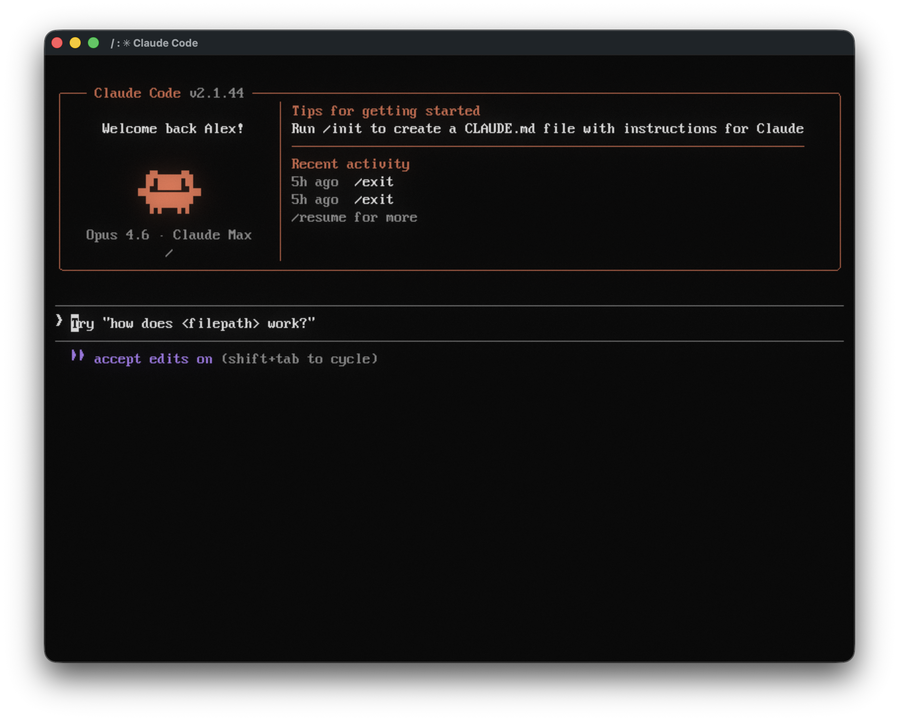 | 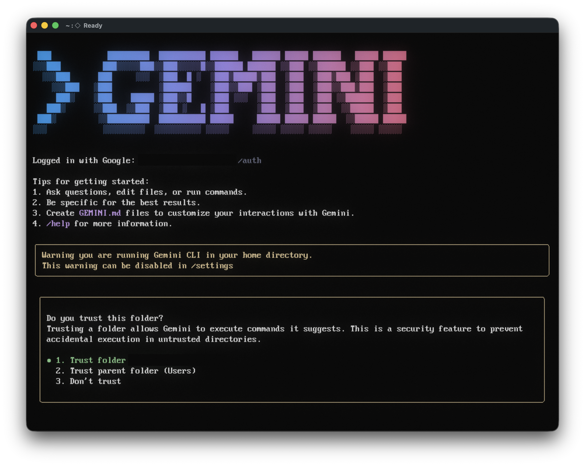 |

## Building

### macOS
```bash
brew install qt6
git clone --recursive https://github.com/hotbit9/crt-plus.git
cd crt-plus
qmake6 && make
```

## Credits
Based on [cool-retro-term](https://github.com/Swordfish90/cool-retro-term) by Filippo Scognamiglio.
